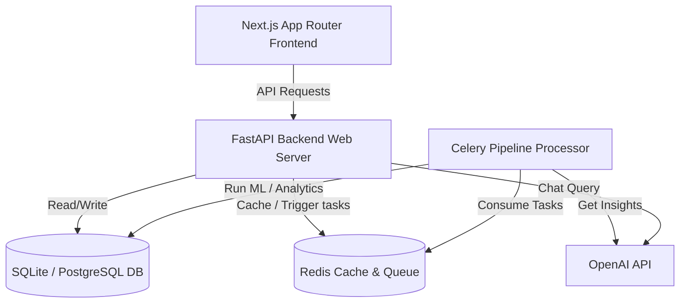

# Sightfill

### AI-Powered Customer Insights, Analytics, Forecasting & Recommendation Platform

---

### 🌐 Live Production Deployments
*   **Live Web Client (Frontend)**: [https://ready-nest-internship-week2-one.vercel.app](https://ready-nest-internship-week2-one.vercel.app)
*   **Live Web Server (Backend API)**: [https://readynest-internship-week2.onrender.com](https://readynest-internship-week2.onrender.com)
*   **Live API Documentation (Swagger Docs)**: [https://readynest-internship-week2.onrender.com/docs](https://readynest-internship-week2.onrender.com/docs)

---

Sightfill is a production-grade full-stack SaaS business intelligence application that cleans sales datasets, runs RFM segmentation, models time-series forecasts, and provides interactive AI analyst chatbot consulting.


---

## Codebase Architecture



---

## Directory Structure

```
Sightfill/
├── frontend/             # Next.js 14+ / TS / Tailwind / Recharts
├── backend/              # FastAPI / Python 3.13+ / SQLAlchemy / Alembic
│   ├── app/
│   │   ├── api/          # Routers (auth, projects, datasets, ai, reports)
│   │   ├── services/     # Processing, reports building, AI models
│   │   ├── models.py     # SQLAlchemy DB models
│   │   └── database.py   # Database engine setup
│   ├── scripts/          # Seeding and mock data generators
│   └── tests/            # Pytest test cases
├── sample-datasets/      # Excel & CSV samples for Retail, Subscriptions, E-commerce
├── docker-compose.yml    # Multi-container local execution
└── README.md             # This documentation
```

---

## Installation & Setup

### Option 1: Native Local Execution

#### 1. Setup Backend
1. Navigate to the backend directory:
   ```bash
   cd backend
   ```
2. Create and activate a Python virtual environment:
   ```bash
   python -m venv venv
   # On Windows:
   .\venv\Scripts\activate
   # On macOS/Linux:
   source venv/bin/activate
   ```
3. Install dependencies:
   ```bash
   pip install -r requirements.txt
   ```
4. Run Alembic migrations:
   ```bash
   alembic upgrade head
   ```
5. Seed demo database:
   ```bash
   python scripts/seed_demo_data.py
   ```
6. Start the FastAPI development server:
   ```bash
   uvicorn app.main:app --reload --port 8000
   ```
   *The Swagger API documentation will be available at `http://localhost:8000/docs` (local) or [https://readynest-internship-week2.onrender.com/docs](https://readynest-internship-week2.onrender.com/docs) (production)*

#### 2. Setup Frontend
1. Navigate to the frontend directory:
   ```bash
   cd ../frontend
   ```
2. Install npm packages:
   ```bash
   npm install
   ```
3. Run Next.js in development mode:
   ```bash
   npm run dev
   ```
   *The cockpit will be available at `http://localhost:3000` (local) or [https://ready-nest-internship-week2-one.vercel.app](https://ready-nest-internship-week2-one.vercel.app) (production)*

---

### Option 2: Docker Compose Setup

Run the entire platform with one command:
```bash
docker-compose up --build
```
This launches:
- **PostgreSQL**: Relational database on `localhost:5432`
- **Redis**: Caching broker on `localhost:6379`
- **FastAPI API**: Running on `localhost:8000`
- **Celery Worker**: Managing cleaning and forecasting runs
- **Next.js Client**: Running on `localhost:3000`

---

## API Router Reference Map

| Resource | Method | Endpoint | Description |
| :--- | :--- | :--- | :--- |
| **Auth** | POST | `/api/v1/auth/register` | Register new user + workspace |
| **Auth** | POST | `/api/v1/auth/login` | Login and issue JWT tokens |
| **Projects** | GET | `/api/v1/workspaces` | List active user workspaces |
| **Projects** | POST | `/api/v1/workspaces/{id}/projects` | Create a new project |
| **Datasets** | POST | `/api/v1/projects/{id}/datasets/upload` | Upload sales spreadsheet |
| **Datasets** | PUT | `/api/v1/projects/{id}/datasets/{did}/mapping` | Update schema column mappings |
| **Datasets** | POST | `/api/v1/projects/{id}/datasets/{did}/process` | Trigger cleaning & ML forecasts |
| **Analytics**| GET | `/api/v1/projects/{id}/analytics/{type}` | Get cached EDA/KPI metrics |
| **AI Analyst**| POST| `/api/v1/projects/{id}/ai/conversations` | Create a new consultant chat |
| **AI Analyst**| POST| `/api/v1/projects/{id}/ai/conversations/{id}/chat` | Send question using summaries |
| **Reports** | POST | `/api/v1/projects/{id}/reports/generate` | Build PDF/PPTX/Excel summaries |
| **Reports** | POST | `/api/v1/projects/{id}/reports/{id}/share` | Generate secure read-only token |

---

## Demo Credentials & Quick Start

For a quick evaluation, click the **"Sign In as Demo User"** button on the frontend login page. This performs passwordless authentication for the demo user account.

To customize or seed credentials manually:
- Set `ADMIN_EMAIL` and `ADMIN_PASSWORD` in your backend environment variables before running the seeder script.
- Set `DEMO_EMAIL` and `DEMO_PASSWORD` in your backend environment variables to configure the quick start demo user.
